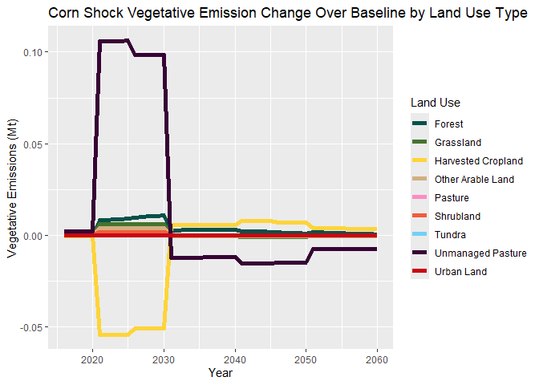

Future Shock Scenarios
================
Mandy Liesch
2025-02-20

- [Load Packages and Files](#load-packages-and-files)
  - [Land Use Color Pallet](#land-use-color-pallet)
- [Land Use](#land-use)
  - [Shock Scenario Land Use Plots](#shock-scenario-land-use-plots)
- [Vegetative Data](#vegetative-data)
  - [Vegetative Graphs](#vegetative-graphs)
  - [Soils Data](#soils-data)
  - [Net Emissions](#net-emissions)

## Load Packages and Files

``` r
library(tidyverse)

landUse<-read_csv("LandUse_Shocks.csv")
```

    ## Rows: 207 Columns: 15
    ## ── Column specification ───────────────────────────────────────────────────────────────────────────────────
    ## Delimiter: ","
    ## chr  (4): scenario, region, LandLeaf, Units
    ## dbl (11): 2010, 2015, 2020, 2025, 2030, 2035, 2040, 2045, 2050, 2055, 2060
    ## 
    ## ℹ Use `spec()` to retrieve the full column specification for this data.
    ## ℹ Specify the column types or set `show_col_types = FALSE` to quiet this message.

``` r
vegShocks<-read_csv("Vegetative_Shocks.csv")
```

    ## Rows: 207 Columns: 95
    ## ── Column specification ───────────────────────────────────────────────────────────────────────────────────
    ## Delimiter: ","
    ## chr  (4): scenario, region, LandLeaf, Units
    ## dbl (91): 2010, 2011, 2012, 2013, 2014, 2015, 2016, 2017, 2018, 2019, 2020, 2021, 2022, 2023, 2024, 202...
    ## 
    ## ℹ Use `spec()` to retrieve the full column specification for this data.
    ## ℹ Specify the column types or set `show_col_types = FALSE` to quiet this message.

### Land Use Color Pallet

``` r
LUColors <- c("UrbanLand"="#C80813FF", "Tundra"="#71D0F5FF", 
              "Rock/Ice/Desert"="#8A9197FF", "Cropland" = "#FED439FF",
              "HarvCropLand"="#FED439FF", "OtherArableLand" = "#D2AF81FF", 
              "Pasture"= "#FD8CC1FF", "UnmanagedPasture"="#370335FF", 
              "Grassland" = "#46732EFF", "Forest" = "#075149FF", 
              "Shrubland" = "#F05C3BFF", "otherNotArable"="#8A9197FF")

# Vegetative Based Color Pallet
vegCEmissions<-c("#46732EFF")

ModelColors<- c("FAO"="#370335FF", "Houghton" = "#FED439FF", 
                "GCAM" = "#FED439FF", "HWSD"="#1A9993FF", "SG17" = "#197EC0FF",
                "SG20"="#F05C3BFF")
```

# Land Use

``` r
#Break up the land leaf columns into subsets 
#(each land leaf has 4 different categories)
new_LU<-landUse %>% 
  separate(LandLeaf, c("LandUse", "Basin", "Water", "Input")) %>%
  separate(scenario, into = c('scenario', 'date'), sep = ",") %>%
  select(-c("date", "Basin", "Units"))
```

    ## Warning: Expected 4 pieces. Missing pieces filled with `NA` in 39 rows [17, 18, 27, 32, 33, 34, 35, 36, 45, 54, 55,
    ## 56, 57, 86, 87, 96, 101, 102, 103, 104, ...].

``` r
#Sum together all of the land leaf files by land use type
sum_new_LU<- new_LU %>% 
  group_by(scenario, LandUse) %>% 
  summarise(across(where(is.numeric), sum))
```

    ## `summarise()` has grouped output by 'scenario'. You can override using the `.groups` argument.

``` r
#Reclassify land use types into broader categories
cat_LU<-sum_new_LU %>% 
  mutate(Category = case_when(
  #Cropland category  
  LandUse %in% 
    #Biomass Crops
    c("biomassGrass", "biomassTree",  
    #Fodder Crops
      "FodderGrass", "FodderHerb", 
    #Grain Crops
      "Corn",  "Soybean", "Wheat", "OtherGrain",
    #Oil Crops
      "OilCrop", "Rapeseed", 
    #Other Crops
      "FiberCrop", "MiscCrop", "RootTuber",  "SugarCrop") 
    #Land Use Name
      ~ "HarvCropLand",
    #Other Arable Land
    LandUse == "OtherArableLand" ~"OtherArableLand",
    #Forest categories
    LandUse %in% c("Forest", "UnmanagedForest", "ProtectedUnmanagedForest")
                ~ "Forest",
    #Grassland categories
    LandUse %in% c("Grassland", "ProtectedGrassland") ~ "Grassland", 
    #Pasture category
    LandUse=="Pasture" ~ "Pasture",
    #Unamanged pasture category
    LandUse %in% c("ProtectedUnmanagedPasture", "UnmanagedPasture") 
              ~ "UnmanagedPasture",
    #Shrubland category
    LandUse %in% c("Shrubland", "ProtectedShrubland") ~ "Shrubland",
    #Other categories
    LandUse=="Tundra" ~ "Tundra",
    LandUse=="UrbanLand" ~ "UrbanLand",
    #Default Return Statement
    TRUE~NA_character_
  )
)

#Sum everything up by defined land use category
sum_cat_LU<-cat_LU %>% 
  group_by(scenario, Category) %>% 
  summarise(across(where(is.numeric), sum))
```

    ## `summarise()` has grouped output by 'scenario'. You can override using the `.groups` argument.

``` r
#Create a long dataframe with land use, years, and area 
wide_sum_LU<-sum_cat_LU %>% 
  pivot_longer(!c(scenario, Category), names_to=c("year"), values_to = "area") %>%
  #convert years into the numeric values
  mutate(year = as.numeric(year)) %>% 
  pivot_wider(names_from = scenario, values_from = c(area)) %>%
  mutate(DifCornShock = CORN1BG - BASE) %>%
  mutate(DifSoyShock = SOY1BG - BASE) %>%
  mutate(soyMinCorn = SOY1BG- CORN1BG)
```

## Shock Scenario Land Use Plots

``` r
#Create a spaghetti plot of land use area using area by category
CornShockLandUseLines.plt<-ggplot(data= wide_sum_LU %>%
                                    filter(year >2015), 
                         aes(x=year, y=DifCornShock, group=Category))+
  geom_line(aes(color=Category), size=2) +
  #add a title
  ggtitle("Corn Shock Land Use Change Over Baseline by Land Use Type") +
  #add labels
  labs( x='Year', y='Land Area (thous sq km)') +
  #use the custom color pallette
  scale_color_manual(values=LUColors, name = "Land Use", 
                     labels = c( "Forest", "Grassland", "Harvested Cropland", 
                                 "Other Arable Land", "Pasture", "Shrubland", 
                                 "Tundra", "Unmanaged Pasture", "Urban Land"))
```

    ## Warning: Using `size` aesthetic for lines was deprecated in ggplot2 3.4.0.
    ## ℹ Please use `linewidth` instead.
    ## This warning is displayed once every 8 hours.
    ## Call `lifecycle::last_lifecycle_warnings()` to see where this warning was generated.

``` r
#Create a spaghetti plot of land use area using area by category
SoyShockLandUseLines.plt<-ggplot(data= wide_sum_LU %>%
                                    filter(year >2015), 
                         aes(x=year, y=DifSoyShock, group=Category))+
  geom_line(aes(color=Category), size=2) +
  #add a title
  ggtitle("Soy Shock Land Use Change Over Baseline by Land Use Type") +
  #add labels
  labs( x='Year', y='Land Area (thous sq km)') +
  #use the custom color pallette
  scale_color_manual(values=LUColors, name = "Land Use", 
                     labels = c( "Forest", "Grassland", "Harvested Cropland", 
                                 "Other Arable Land", "Pasture", "Shrubland", 
                                 "Tundra", "Unmanaged Pasture", "Urban Land"))

#Create a spaghetti plot of land use area using area by category
SoyMinusCornShockLandUseLines.plt<-ggplot(data= wide_sum_LU %>%
                                    filter(year >2015), 
                         aes(x=year, y=soyMinCorn, group=Category))+
  geom_line(aes(color=Category), size=2) +
  #add a title
  ggtitle("Soy Shock Minus Corn Shock Land Use Change by Land Use Type") +
  #add labels
  labs( x='Year', y='Land Area (thous sq km)') +
  #use the custom color pallette
  scale_color_manual(values=LUColors, name = "Land Use", 
                     labels = c( "Forest", "Grassland", "Harvested Cropland", 
                                 "Other Arable Land", "Pasture", "Shrubland", 
                                 "Tundra", "Unmanaged Pasture", "Urban Land"))
```

# Vegetative Data

``` r
#Break up the land leaf columns into subsets 
#(each land leaf has 4 different categories)
new_veg<-vegShocks %>% 
  separate(LandLeaf, c("LandUse", "Basin", "Water", "Input")) %>%
  separate(scenario, into = c('scenario', 'date'), sep = ",") %>%
  select(-c("date", "Basin", "Units"))
```

    ## Warning: Expected 4 pieces. Missing pieces filled with `NA` in 39 rows [17, 18, 27, 32, 33, 34, 35, 36, 45, 54, 55,
    ## 56, 57, 86, 87, 96, 101, 102, 103, 104, ...].

``` r
#Sum together all of the land leaf files by land use type
sum_new_veg<- new_veg %>% 
  group_by(scenario, LandUse) %>% 
  summarise(across(where(is.numeric), sum))
```

    ## `summarise()` has grouped output by 'scenario'. You can override using the `.groups` argument.

``` r
#Reclassify land use types into broader categories
cat_veg<-sum_new_veg %>% 
  mutate(Category = case_when(
  #Cropland category  
  LandUse %in% 
    #Biomass Crops
    c("biomassGrass", "biomassTree",  
    #Fodder Crops
      "FodderGrass", "FodderHerb", 
    #Grain Crops
      "Corn",  "Soybean", "Wheat", "OtherGrain",
    #Oil Crops
      "OilCrop", "Rapeseed", 
    #Other Crops
      "FiberCrop", "MiscCrop", "RootTuber",  "SugarCrop") 
    #Land Use Name
      ~ "HarvCropLand",
    #Other Arable Land
    LandUse == "OtherArableLand" ~"OtherArableLand",
    #Forest categories
    LandUse %in% c("Forest", "UnmanagedForest", "ProtectedUnmanagedForest")
                ~ "Forest",
    #Grassland categories
    LandUse %in% c("Grassland", "ProtectedGrassland") ~ "Grassland", 
    #Pasture category
    LandUse=="Pasture" ~ "Pasture",
    #Unamanged pasture category
    LandUse %in% c("ProtectedUnmanagedPasture", "UnmanagedPasture") 
              ~ "UnmanagedPasture",
    #Shrubland category
    LandUse %in% c("Shrubland", "ProtectedShrubland") ~ "Shrubland",
    #Other categories
    LandUse=="Tundra" ~ "Tundra",
    LandUse=="UrbanLand" ~ "UrbanLand",
    #Default Return Statement
    TRUE~NA_character_
  )
)

#Sum everything up by defined land use category
sum_cat_veg<-cat_veg %>% 
  group_by(scenario, Category) %>% 
  summarise(across(where(is.numeric), sum)) %>%
  select(scenario:'2060')
```

    ## `summarise()` has grouped output by 'scenario'. You can override using the `.groups` argument.

``` r
#Create a long dataframe with land use, years, and area 
wide_sum_veg<-sum_cat_veg  %>% 
  pivot_longer(!c(scenario, Category), names_to=c("year"), values_to = "area") %>%
  #convert years into the numeric values
  mutate(year = as.numeric(year)) %>% 
  pivot_wider(names_from = scenario, values_from = c(area)) %>%
  mutate(DifCornShock = CORN1BG - BASE) %>%
  mutate(DifSoyShock = SOY1BG - BASE) 
```

## Vegetative Graphs

``` r
#Create a spaghetti plot of land use area using area by category
CornShockVegLines.plt<-ggplot(data= wide_sum_veg %>%
                                    filter(year >2015), 
                         aes(x=year, y=DifCornShock, group=Category))+
  geom_line(aes(color=Category), size=2) +
  #add a title
  ggtitle("Corn Shock Vegetative Emission Change Over Baseline by Land Use Type") +
  #add labels
  labs( x='Year', y='Vegetative Emissions (Mt)') +
  #use the custom color pallette
  scale_color_manual(values=LUColors, name = "Land Use", 
                     labels = c( "Forest", "Grassland", "Harvested Cropland", 
                                 "Other Arable Land", "Pasture", "Shrubland", 
                                 "Tundra", "Unmanaged Pasture", "Urban Land"))


#Create a spaghetti plot of land use area using area by category
SoyShockVegUseLines.plt<-ggplot(data= wide_sum_veg %>%
                                    filter(year >2015), 
                         aes(x=year, y=DifSoyShock, group=Category))+
  geom_line(aes(color=Category), size=2) +
  #add a title
  ggtitle("Soy Shock Vegetative Change Over Baseline by Land Use Type") +
  #add labels
  labs( x='Year', y='Vegetative Emissions (Mt)') +
  #use the custom color pallette
  scale_color_manual(values=LUColors, name = "Land Use", 
                     labels = c( "Forest", "Grassland", "Harvested Cropland", 
                                 "Other Arable Land", "Pasture", "Shrubland", 
                                 "Tundra", "Unmanaged Pasture", "Urban Land"))
```

## Soils Data

``` r
#Create a series loop to read in all of the data

#Create a list of all .csv files in the output folder
files <- list.files(path="~/github/GCAMShocks/GCAM_Shocks/Shocks", pattern = "\\values.csv$", 
                    full.names = TRUE)

#Initialize an empty list to store data frames
data_list <- list()

# Loop over each file and read it into a data frame
for (file in files) {
  data <- read.csv(file)
  data_list[[file]] <- data
}

# Combine all data frames into one
combined_shock_soil_data <- bind_rows(data_list)

new_Soil_Shock_Emiss<- combined_shock_soil_data %>% 
  separate(LandLeaf, c("LandUse", "Basin", "Water", "Input")) %>%
  separate(scenario, into = c('scenario', 'date'), sep = ",") %>%
  select(-c("date", "region", "Basin", "Units"))  %>%
  select(Series:'X2060')
```

    ## Warning: Expected 4 pieces. Missing pieces filled with `NA` in 195 rows [17, 18, 27, 32, 33, 34, 35, 36, 45, 54,
    ## 55, 56, 57, 86, 87, 96, 101, 102, 103, 104, ...].

``` r
#Sum together all of the land leaf files by land use type
sum_new_Soil_Emiss<- new_Soil_Shock_Emiss %>% 
  group_by(Series, scenario, LandUse) %>% 
  summarise(across(where(is.numeric), sum))
```

    ## `summarise()` has grouped output by 'Series', 'scenario'. You can override using the `.groups` argument.

``` r
#Reclassify land use types into broader categories
cat_Soil_Emiss<-sum_new_Soil_Emiss %>% 
  mutate(Category = case_when(
  #Cropland category  
  LandUse %in% 
    #Biomass Crops
    c("biomassGrass", "biomassTree",  
    #Fodder Crops
      "FodderGrass", "FodderHerb", 
    #Grain Crops
      "Corn",  "Soybean", "Wheat", "OtherGrain",
    #Oil Crops
      "OilCrop", "Rapeseed", 
    #Other Crops
      "FiberCrop", "MiscCrop", "RootTuber",  "SugarCrop") 
    #Land Use Name
      ~ "HarvCropLand",
    #Other Arable Land
    LandUse == "OtherArableLand" ~"OtherArableLand",
    #Forest categories
    LandUse %in% c("Forest", "UnmanagedForest", "ProtectedUnmanagedForest")
                ~ "Forest",
    #Grassland categories
    LandUse %in% c("Grassland", "ProtectedGrassland") ~ "Grassland", 
    #Pasture category
    LandUse=="Pasture" ~ "Pasture",
    #Unamanged pasture category
    LandUse %in% c("ProtectedUnmanagedPasture", "UnmanagedPasture") 
              ~ "UnmanagedPasture",
    #Shrubland category
    LandUse %in% c("Shrubland", "ProtectedShrubland") ~ "Shrubland",
    #Other categories
    LandUse=="Tundra" ~ "Tundra",
    LandUse=="UrbanLand" ~ "UrbanLand",
    #Default Return Statement
    TRUE~NA_character_
  )
)

#Sum everything up by defined land use category
sum_cat_soil_emiss<- cat_Soil_Emiss %>% 
  group_by(Series, scenario, Category) %>% 
  summarise(across(where(is.numeric), sum))
```

    ## `summarise()` has grouped output by 'Series', 'scenario'. You can override using the `.groups` argument.

``` r
#Create a long dataframe with land use, years, and area 
wide_sum_soil_emiss<- sum_cat_soil_emiss %>% 
  pivot_longer(!c(Series, scenario, Category), names_to=c("year"), values_to = "area") %>%
  #Remove the extra X value from the dataset
  mutate(across(c('year'), substr, 2, nchar(year))) %>%
  #convert years into the numeric values
  mutate(year = as.numeric(year)) %>% 
  pivot_wider(names_from = scenario, values_from = c(area)) %>%
  mutate(DifCornShock = CORN1BG - BASE) %>%
  mutate(DifSoyShock = SOY1BG - BASE)
```

    ## Warning: There was 1 warning in `mutate()`.
    ## ℹ In argument: `across(c("year"), substr, 2, nchar(year))`.
    ## ℹ In group 1: `Series = "FAO"` `scenario = "BASE"`.
    ## Caused by warning:
    ## ! The `...` argument of `across()` is deprecated as of dplyr 1.1.0.
    ## Supply arguments directly to `.fns` through an anonymous function instead.
    ## 
    ##   # Previously
    ##   across(a:b, mean, na.rm = TRUE)
    ## 
    ##   # Now
    ##   across(a:b, \(x) mean(x, na.rm = TRUE))

``` r
cum_soil_emiss_sums<-wide_sum_soil_emiss %>%
   group_by(Series, year) %>% 
  summarise(across(where(is.numeric), sum)) %>%
#calculate the cumulative emissions
  mutate(aggDifCorncount = cumsum(DifCornShock)) %>%
  mutate(aggDifSoycount = cumsum(DifSoyShock))
```

    ## `summarise()` has grouped output by 'Series'. You can override using the `.groups` argument.

## Net Emissions

``` r
mergedData<-merge(wide_sum_soil_emiss, wide_sum_veg, 
                  by=c("Category", "year"), all=TRUE) %>%
#rename all of the columns after the merge
               rename( c( "BASE.soil" ="BASE.x", 
                           "BASE.veg" = "BASE.y", 
                           "CORN1BG.soil" =  "CORN1BG.x", 
                           "CORN1BG.veg" = "CORN1BG.y",
                          "SOY1BG.soil" =  "SOY1BG.x", 
                           "SOY1BG.veg" = "SOY1BG.y",
                          "DifCornShock.soil" = "DifCornShock.x", 
                          "DifSoyShock.soil" = "DifSoyShock.x", 
                           "DifCornShock.veg" = "DifCornShock.y", 
                          "DifSoyShock.veg" = "DifSoyShock.y" )) %>%
                mutate(netDifCornShock = DifCornShock.soil + DifCornShock.veg) %>%
                mutate(netDifSoyShock = DifSoyShock.soil + DifSoyShock.veg)

sum_merged_data <- mergedData %>%
   group_by(Series, year) %>% 
  summarise(across(where(is.numeric), sum)) 
```

    ## `summarise()` has grouped output by 'Series'. You can override using the `.groups` argument.

``` r
net_emiss_CS_Models.plt<-ggplot(data= sum_merged_data, 
                         aes(x=year, y=netDifCornShock, group=Series, color=Series))+
  geom_line(aes(), size=2) +
  #add a title
  ggtitle("Total Net Corn Shock Emissions Over Baseline") +
  #add labels
  labs( x='Year', y='Emissions (Mt)') +
  #use the custom color pallette
  scale_color_manual(values=ModelColors)


net_emiss_SS_Models.plt<-ggplot(data= sum_merged_data, 
                         aes(x=year, y=netDifSoyShock, group=Series, color=Series))+
  geom_line(aes(), size=2) +
  #add a title
  ggtitle("Total Net Soy Shock Emissions Over Baseline") +
  #add labels
  labs( x='Year', y='Emissions (Mt)') +
  #use the custom color pallette
  scale_color_manual(values=ModelColors)
```

``` r
cum_soil_emiss_sums_CS_Models.plt<-ggplot(data= cum_soil_emiss_sums %>%
                                    filter(year > 2015), 
                         aes(x=year, y=DifCornShock, group=Series))+
  geom_line(aes(color=Series), size=2) +
  #add a title
  ggtitle("Total Corn Shock Emissions Over Baseline") +
  #add labels
  labs( x='Year', y='Emissions (Mt)') +
  #use the custom color pallette
  scale_color_manual(values=ModelColors)

cum_soil_emiss_sums_SS_Models.plt<-ggplot(data= cum_soil_emiss_sums %>%
                                    filter(year > 2015), 
                         aes(x=year, y=DifSoyShock, group=Series))+
  geom_line(aes(color=Series), size=2) +
  #add a title
  ggtitle("Total Soy Shock Emissions Over Baseline") +
  #add labels
  labs( x='Year', y='Emissions (Mt)') +
  #use the custom color pallette
  scale_color_manual(values=ModelColors)

tot_cum_soil_emiss_sums_CS_Models.plt<-ggplot(data= cum_soil_emiss_sums %>%
                                    filter(year > 2015), 
                         aes(x=year, y=aggDifCorncount, group=Series))+
  geom_line(aes(color=Series), size=2) +
  #add a title
  ggtitle("Soil Cumulative Corn Shock Emissions Over Baseline") +
  #add labels
  labs( x='Year', y='Emissions (Mt)') +
  #use the custom color pallette
  scale_color_manual(values=ModelColors)


tot_cum_soil_emiss_sums_SS_Models.plt<-ggplot(data= cum_soil_emiss_sums %>%
                                    filter(year > 2015), 
                         aes(x=year, y=aggDifSoycount, group=Series))+
  geom_line(aes(color=Series), size=2) +
  #add a title
  ggtitle("Soil Cumulative Soy Shock Emissions Over Baseline") +
  #add labels
  labs( x='Year', y='Emissions (Mt)') +
  #use the custom color pallette
  scale_color_manual(values=ModelColors)
```

``` r
unmanPast_soil_emiss_sums_CS_Models.plt<-ggplot(data= wide_sum_soil_emiss %>%
                                    filter(Category == "UnmanagedPasture"), 
                         aes(x=year, y=DifCornShock, group=Series))+
  geom_line(aes(color=Series), size=2) +
  #add a title
  ggtitle("Unmanaged Pasture Corn Shock Emissions Over Baseline") +
  #add labels
  labs( x='Year', y='Emissions (Mt)') +
  #use the custom color pallette
  scale_color_manual(values=ModelColors)


unmanPast_soil_emiss_sums_SS_Models.plt<-ggplot(data= wide_sum_soil_emiss %>%
                                    filter(Category == "UnmanagedPasture"), 
                         aes(x=year, y=DifSoyShock, group=Series))+
  geom_line(aes(color=Series), size=2) +
  #add a title
  ggtitle("Unmanaged Pasture Soy Shock Emissions Over Baseline") +
  #add labels
  labs( x='Year', y='Emissions (Mt)') +
  #use the custom color pallette
  scale_color_manual(values=ModelColors)
```

``` r
CornShockVegLines.plt
```

<!-- -->
